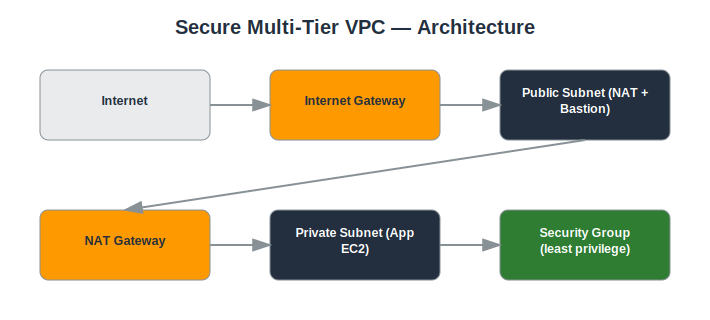

# Project: Secure Multi-Tier VPC

## Objective
Design and deploy a secure, multi-tier AWS network architecture for a web application, separating public-facing and private resources.

## Services Used
- Amazon VPC
- EC2
- Internet Gateway
- NAT Gateway
- Route Tables
- Security Groups
- Network ACLs

## Architecture
- 1 VPC with public and private subnets across 2 Availability Zones
- Internet Gateway attached for public subnet internet access
- NAT Gateway for outbound internet access from private subnet
- Route tables configured per subnet tier
- Security Groups restricting inbound/outbound traffic
- Network ACLs as an additional stateless layer of defense



## Implementation Steps

**1. Create the VPC**

*Console:*
  - VPC console → **Your VPCs** → **Create VPC**
  - Choose 'VPC only', set IPv4 CIDR to `10.0.0.0/16`
  - Name it `secure-vpc` → Create VPC

*CLI:*
```bash
aws ec2 create-vpc --cidr-block 10.0.0.0/16 --tag-specifications 'ResourceType=vpc,Tags=[{Key=Name,Value=secure-vpc}]'
```

**2. Create public and private subnets**

*Console:*
  - VPC console → **Subnets** → **Create subnet**
  - Select `secure-vpc`, AZ `us-east-1a`, CIDR `10.0.1.0/24` → name `public-subnet-1a`
  - Repeat with CIDR `10.0.2.0/24` → name `private-subnet-1a` (repeat both in a 2nd AZ for HA)

*CLI:*
```bash
aws ec2 create-subnet --vpc-id <VPC_ID> --cidr-block 10.0.1.0/24 --availability-zone us-east-1a --tag-specifications 'ResourceType=subnet,Tags=[{Key=Name,Value=public-subnet-1a}]'
aws ec2 create-subnet --vpc-id <VPC_ID> --cidr-block 10.0.2.0/24 --availability-zone us-east-1a --tag-specifications 'ResourceType=subnet,Tags=[{Key=Name,Value=private-subnet-1a}]'
```

**3. Create and attach an Internet Gateway**

*Console:*
  - VPC console → **Internet Gateways** → **Create internet gateway** → name it → Create
  - Select it → **Actions** → **Attach to VPC** → choose `secure-vpc`

*CLI:*
```bash
aws ec2 create-internet-gateway --tag-specifications 'ResourceType=internet-gateway,Tags=[{Key=Name,Value=secure-vpc-igw}]'
aws ec2 attach-internet-gateway --vpc-id <VPC_ID> --internet-gateway-id <IGW_ID>
```

**4. Create a public route table and route to the IGW**

*Console:*
  - VPC console → **Route Tables** → **Create route table**, associate with `secure-vpc`
  - Select it → **Routes** tab → **Edit routes** → Add route `0.0.0.0/0` → target the Internet Gateway
  - **Subnet associations** tab → Edit → select `public-subnet-1a`

*CLI:*
```bash
aws ec2 create-route-table --vpc-id <VPC_ID>
aws ec2 create-route --route-table-id <PUBLIC_RT_ID> --destination-cidr-block 0.0.0.0/0 --gateway-id <IGW_ID>
aws ec2 associate-route-table --route-table-id <PUBLIC_RT_ID> --subnet-id <PUBLIC_SUBNET_ID>
```

**5. Allocate an Elastic IP and deploy a NAT Gateway**

*Console:*
  - VPC console → **NAT Gateways** → **Create NAT gateway**
  - Select `public-subnet-1a`, click **Allocate Elastic IP**, then **Create NAT gateway**

*CLI:*
```bash
aws ec2 allocate-address --domain vpc
aws ec2 create-nat-gateway --subnet-id <PUBLIC_SUBNET_ID> --allocation-id <EIP_ALLOC_ID>
```

**6. Create a private route table pointing to the NAT Gateway**

*Console:*
  - VPC console → **Route Tables** → **Create route table**, associate with `secure-vpc`
  - **Edit routes** → Add `0.0.0.0/0` → target the NAT Gateway
  - **Subnet associations** → select `private-subnet-1a`

*CLI:*
```bash
aws ec2 create-route --route-table-id <PRIVATE_RT_ID> --destination-cidr-block 0.0.0.0/0 --nat-gateway-id <NAT_GW_ID>
aws ec2 associate-route-table --route-table-id <PRIVATE_RT_ID> --subnet-id <PRIVATE_SUBNET_ID>
```

**7. Create Security Groups**

*Console:*
  - EC2 console → **Security Groups** → **Create security group** → name `public-sg`
  - Inbound rules → Add rule: SSH (22), Source = My IP
  - Create a second SG `private-sg` → Inbound rule: SSH (22), Source = `public-sg` (select the SG, not an IP)

*CLI:*
```bash
aws ec2 create-security-group --group-name public-sg --description "Public tier" --vpc-id <VPC_ID>
aws ec2 authorize-security-group-ingress --group-id <PUBLIC_SG_ID> --protocol tcp --port 22 --cidr <YOUR_IP>/32
aws ec2 authorize-security-group-ingress --group-id <PRIVATE_SG_ID> --protocol tcp --port 22 --source-group <PUBLIC_SG_ID>
```

**8. Launch and verify**

*Console:*
  - EC2 console → **Launch instance** → choose `public-subnet-1a`, attach `public-sg`, enable auto-assign public IP
  - Launch a second instance in `private-subnet-1a` with `private-sg`, no public IP
  - Connect to the public instance, then SSH from it into the private instance to confirm the path works

*CLI:*
```bash
# Verify the private instance has no public IP
aws ec2 describe-instances --instance-ids <PRIVATE_INSTANCE_ID> --query 'Reservations[0].Instances[0].PublicIpAddress'
# From inside the private instance, confirm outbound internet works via NAT
curl -sI https://amazon.com | head -1
```

## Security Considerations
- Private EC2 instances are not directly accessible from the internet.
- SSH/RDP access restricted to a specific trusted IP range.
- Security Groups follow least-privilege principles (only required ports open).
- Public subnet only hosts resources that must be internet-facing (e.g., load balancer, bastion host).

## What I Learned
Hands-on understanding of VPC routing, subnet design, NAT Gateway configuration, and the difference between stateful (Security Group) and stateless (NACL) network controls.

## Result
Successfully deployed a secure two-tier network where private resources are isolated from direct internet access while retaining outbound connectivity.

## Repository Contents
- `README.md` — this file
- `templates/` — Terraform / CloudFormation / IAM policy JSON (if applicable)
- `screenshots/` — AWS Console screenshots (optional)
- `architecture.svg` — architecture diagram (included)

---
*Part of my [AWS Cloud Security Portfolio](../README.md).*
