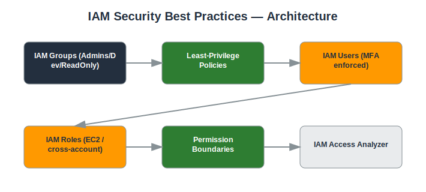

# Project: IAM Security Best Practices

## Objective
Implement AWS Identity and Access Management (IAM) following least-privilege and defense-in-depth principles.

## Services Used
- IAM
- IAM Identity Center (optional)
- CloudTrail (for auditing)

## Architecture
- IAM users organized into groups by function (Admins, Developers, ReadOnly)
- Custom least-privilege IAM policies instead of AWS managed AdministratorAccess
- IAM roles for cross-account and service-to-service access
- Permission boundaries to cap maximum allowed permissions
- MFA enforced for all console users



## Implementation Steps

**1. Create IAM groups**

*Console:*
  - IAM console → **User groups** → **Create group** → name `Developers` → Create
  - Repeat for `ReadOnly`

*CLI:*
```bash
aws iam create-group --group-name Developers
aws iam create-group --group-name ReadOnly
```

**2. Attach least-privilege policies**

*Console:*
  - Select `ReadOnly` group → **Permissions** tab → **Add permissions** → Attach `ReadOnlyAccess`
  - Select `Developers` group → **Add permissions** → **Create inline policy** → paste your least-privilege JSON

*CLI:*
```bash
aws iam attach-group-policy --group-name ReadOnly --policy-arn arn:aws:iam::aws:policy/ReadOnlyAccess
aws iam put-group-policy --group-name Developers --policy-name dev-least-priv --policy-document file://dev-policy.json
```

**3. Create users and assign to groups only**

*Console:*
  - IAM console → **Users** → **Create user** → name `jsmith`, do NOT attach policies directly
  - On the permissions step, choose **Add user to group** → select `Developers`

*CLI:*
```bash
aws iam create-user --user-name jsmith
aws iam add-user-to-group --user-name jsmith --group-name Developers
```

**4. Enforce MFA**

*Console:*
  - IAM console → select the user → **Security credentials** tab → **Assign MFA device** → follow the QR-code setup with an authenticator app
  - Attach an account-wide policy that denies actions unless `aws:MultiFactorAuthPresent` is true

*CLI:*
```bash
# Attach the AWS-provided 'force MFA' policy to a group
aws iam attach-group-policy --group-name Developers --policy-arn arn:aws:iam::aws:policy/IAMUserChangePassword
```

**5. Create an EC2 IAM role instead of embedding keys**

*Console:*
  - IAM console → **Roles** → **Create role** → Trusted entity: AWS service → EC2
  - Attach a least-privilege custom policy → name it `ec2-app-role`
  - EC2 console → when launching an instance, under **IAM instance profile**, select this role

*CLI:*
```bash
aws iam create-role --role-name ec2-app-role --assume-role-policy-document file://trust-policy.json
aws iam put-role-policy --role-name ec2-app-role --policy-name app-least-priv --policy-document file://app-policy.json
aws iam create-instance-profile --instance-profile-name ec2-app-profile
aws iam add-role-to-instance-profile --instance-profile-name ec2-app-profile --role-name ec2-app-role
```

**6. Apply a permission boundary**

*Console:*
  - IAM console → select the role → **Permissions boundary** → **Set boundary** → choose `MaxPermissionsBoundary` policy

*CLI:*
```bash
aws iam put-role-permissions-boundary --role-name ec2-app-role --permissions-boundary arn:aws:iam::<ACCOUNT_ID>:policy/MaxPermissionsBoundary
```

**7. Run IAM Access Analyzer**

*Console:*
  - IAM console → **Access Analyzer** → **Create analyzer** → type: Account → Create
  - Review the **Findings** tab for unused permissions or unexpected external access

*CLI:*
```bash
aws accessanalyzer create-analyzer --analyzer-name account-analyzer --type ACCOUNT
aws accessanalyzer list-findings --analyzer-arn <ANALYZER_ARN>
```

**8. Validate with Policy Simulator**

*Console:*
  - IAM console → **Policy simulator** (search in top bar) → select the `Developers` group → test action `iam:CreateUser` on `*` → confirm result is **Denied**

*CLI:*
```bash
# No direct CLI equivalent — validate manually via the console Policy Simulator
```

## Security Considerations
- Root account MFA enabled and root access keys removed.
- No long-lived access keys attached to IAM users where roles can be used instead.
- Policies scoped to specific resources and actions rather than using wildcards.
- Regular access reviews using IAM Access Analyzer and credential reports.

## What I Learned
Practical experience writing least-privilege IAM policies, the difference between identity-based and resource-based policies, and how permission boundaries limit blast radius.

## Result
Established an IAM structure where every identity has only the permissions required for its role, verified through IAM Access Analyzer.

## Repository Contents
- `README.md` — this file
- `templates/` — Terraform / CloudFormation / IAM policy JSON (if applicable)
- `screenshots/` — AWS Console screenshots (optional)
- `architecture.svg` — architecture diagram (included)

---
*Part of my [AWS Cloud Security Portfolio](../README.md).*
