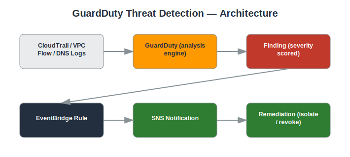

# Project: GuardDuty Threat Detection

## Objective
Enable Amazon GuardDuty to continuously monitor for malicious activity and unauthorized behavior, then investigate and remediate findings.

## Services Used
- Amazon GuardDuty
- CloudTrail
- VPC Flow Logs
- CloudWatch Events (EventBridge)
- SNS

## Architecture
- GuardDuty enabled account-wide, analyzing CloudTrail, VPC Flow Logs, and DNS logs
- EventBridge rule matching GuardDuty findings by severity
- SNS notification for medium/high severity findings
- Documented remediation runbook per finding type



## Implementation Steps

**1. Enable GuardDuty**

*Console:*
  - GuardDuty console → **Get started** → **Enable GuardDuty**

*CLI:*
```bash
aws guardduty create-detector --enable
```

**2. Generate sample findings**

*Console:*
  - GuardDuty console → **Settings** → scroll to **Sample findings** → **Generate sample findings**

*CLI:*
```bash
aws guardduty create-sample-findings --detector-id <DETECTOR_ID> --finding-types UnauthorizedAccess:EC2/SSHBruteForce Recon:EC2/PortProbeUnprotectedPort
```

**3. Route high-severity findings to EventBridge**

*Console:*
  - EventBridge console → **Rules** → **Create rule** → name `guardduty-high-severity`
  - Event pattern: source = `aws.guardduty`, detail → severity ≥ 7 (use the JSON editor)

*CLI:*
```bash
aws events put-rule --name guardduty-high-severity --event-pattern '{"source":["aws.guardduty"],"detail":{"severity":[{"numeric":[">=",7]}]}}'
```

**4. Target an SNS topic from the rule**

*Console:*
  - On the same rule → **Add target** → select SNS topic → choose `security-alerts` (reuse from Project 3) → Save

*CLI:*
```bash
aws events put-targets --rule guardduty-high-severity --targets "Id"="1","Arn"="<SNS_TOPIC_ARN>"
```

**5. Investigate a finding**

*Console:*
  - GuardDuty console → **Findings** → click the finding → review resource, principal, severity, and description panels

*CLI:*
```bash
aws guardduty get-findings --detector-id <DETECTOR_ID> --finding-ids <FINDING_ID>
```

**6. Contain — isolate the instance**

*Console:*
  - EC2 console → select the instance → **Actions** → **Security** → **Change security groups** → select a `quarantine-sg` with no rules

*CLI:*
```bash
aws ec2 modify-instance-attribute --instance-id <INSTANCE_ID> --groups <QUARANTINE_SG_ID>
```

**7. Document and archive**

*Console:*
  - GuardDuty console → select the finding → **Actions** → **Archive**

*CLI:*
```bash
aws guardduty archive-findings --detector-id <DETECTOR_ID> --finding-ids <FINDING_ID>
```

## Security Considerations
- Continuous, automated threat detection with no infrastructure to manage.
- Findings triaged by severity to prioritize response time.
- Remediation steps documented for repeatability.

## What I Learned
How GuardDuty correlates multiple data sources to detect threats, how to interpret finding severity and type, and how to build an alert-to-remediation workflow.

## Result
Implemented continuous threat detection with an automated notification pipeline and documented incident response steps.

## Repository Contents
- `README.md` — this file
- `templates/` — Terraform / CloudFormation / IAM policy JSON (if applicable)
- `screenshots/` — AWS Console screenshots (optional)
- `architecture.svg` — architecture diagram (included)

---
*Part of my [AWS Cloud Security Portfolio](../README.md).*
