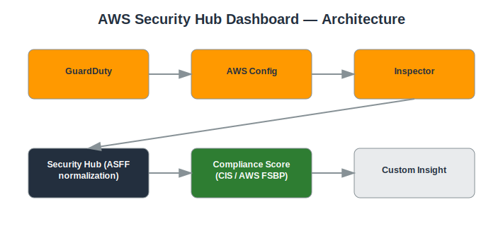

# Project: AWS Security Hub Dashboard

## Objective
Aggregate security findings and compliance checks across multiple AWS services into a single dashboard.

## Services Used
- AWS Security Hub
- GuardDuty
- AWS Config
- Amazon Inspector
- IAM Access Analyzer

## Architecture
- Security Hub enabled with AWS Foundational Security Best Practices standard
- CIS AWS Foundations Benchmark enabled for compliance scoring
- Integrated findings from GuardDuty, Config, and Inspector
- Custom insights created to track specific finding trends



## Implementation Steps

**1. Enable Security Hub**

*Console:*
  - Security Hub console → **Go to Security Hub** → select standards (AWS FSBP, CIS) → **Enable Security Hub**

*CLI:*
```bash
aws securityhub enable-security-hub --enable-default-standards
```

**2. Confirm enabled standards**

*Console:*
  - Security Hub console → **Security standards** tab → confirm both standards show 'Enabled'

*CLI:*
```bash
aws securityhub get-enabled-standards
```

**3. Confirm data sources are integrated**

*Console:*
  - Security Hub console → **Integrations** tab → confirm GuardDuty, Config, and Inspector show as connected

*CLI:*
```bash
# No single CLI call — integrations activate automatically once each service is enabled in-account
```

**4. Review the compliance score**

*Console:*
  - Security Hub console → **Summary** → view the compliance score gauge and the top failed controls list

*CLI:*
```bash
aws securityhub get-findings --filters '{"ComplianceStatus":[{"Value":"FAILED","Comparison":"EQUALS"}]}'
```

**5. Remediate a failed control**

*Console:*
  - S3 console → select the flagged bucket → **Permissions** tab → **Block public access** → edit → enable all four settings → Save

*CLI:*
```bash
aws s3api put-public-access-block --bucket <BUCKET_NAME> --public-access-block-configuration BlockPublicAcls=true,IgnorePublicAcls=true,BlockPublicPolicy=true,RestrictPublicBuckets=true
```

**6. Create a custom Insight**

*Console:*
  - Security Hub console → **Insights** → **Create insight** → group by `ResourceType`, filter `Severity = HIGH` → Save

*CLI:*
```bash
# Insights are console/API-managed; no simple single CLI one-liner — use the console for this step
```

**7. Record before/after score**

*Console:*
  - Screenshot the compliance score before and after remediation for your README as evidence.

## Security Considerations
- Centralized visibility into security posture across the account.
- Prioritized remediation based on compliance standard severity.
- Continuous compliance monitoring rather than a one-time audit.

## What I Learned
How Security Hub normalizes findings from multiple services into a common format (ASFF), and how to use compliance standards to drive a remediation roadmap.

## Result
Built a centralized security dashboard and improved the account's compliance score by remediating key findings.

## Repository Contents
- `README.md` — this file
- `templates/` — Terraform / CloudFormation / IAM policy JSON (if applicable)
- `screenshots/` — AWS Console screenshots (optional)
- `architecture.svg` — architecture diagram (included)

---
*Part of my [AWS Cloud Security Portfolio](../README.md).*
