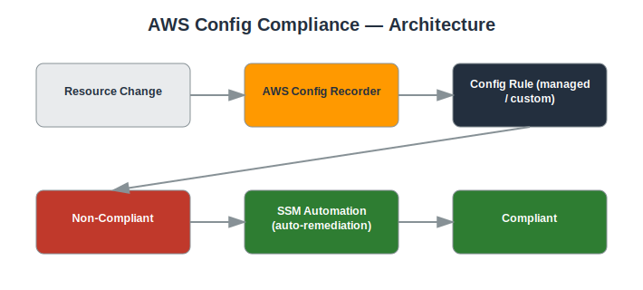

# Project: AWS Config Compliance

## Objective
Use AWS Config to continuously assess resource configurations against compliance rules and automatically remediate violations.

## Services Used
- AWS Config
- Config Rules
- Systems Manager Automation
- SNS

## Architecture
- AWS Config recorder enabled across all supported resource types
- Managed Config Rules for common best practices (e.g., s3-bucket-public-read-prohibited, restricted-ssh)
- Custom Config Rule using a Lambda function
- Automatic remediation using SSM Automation documents



## Implementation Steps

**1. Enable the Config recorder**

*Console:*
  - AWS Config console → **Get started** → select resource types (All resources) → choose/create an S3 bucket for history → choose an IAM role → **Confirm**

*CLI:*
```bash
aws configservice put-configuration-recorder --configuration-recorder name=default,roleARN=<CONFIG_ROLE_ARN>
aws configservice put-delivery-channel --delivery-channel name=default,s3BucketName=<CONFIG_BUCKET>
aws configservice start-configuration-recorder --configuration-recorder-name default
```

**2. Enable a managed rule for public S3 buckets**

*Console:*
  - Config console → **Rules** → **Add rule** → search `s3-bucket-public-read-prohibited` → **Next** → **Add rule**

*CLI:*
```bash
aws configservice put-config-rule --config-rule '{"ConfigRuleName":"s3-bucket-public-read-prohibited","Source":{"Owner":"AWS","SourceIdentifier":"S3_BUCKET_PUBLIC_READ_PROHIBITED"}}'
```

**3. Enable a rule for unrestricted SSH**

*Console:*
  - Config console → **Add rule** → search `restricted-ssh` (or `incoming-ssh-disabled`) → **Add rule**

*CLI:*
```bash
aws configservice put-config-rule --config-rule '{"ConfigRuleName":"restricted-ssh","Source":{"Owner":"AWS","SourceIdentifier":"INCOMING_SSH_DISABLED"}}'
```

**4. Trigger and confirm a violation**

*Console:*
  - EC2 console → open a test Security Group → add an inbound rule: SSH, source `0.0.0.0/0` → Save
  - Config console → **Rules** → `restricted-ssh` → confirm the resource shows **Noncompliant**

*CLI:*
```bash
aws configservice get-compliance-details-by-config-rule --config-rule-name restricted-ssh
```

**5. Attach automatic remediation**

*Console:*
  - Config console → select the `restricted-ssh` rule → **Actions** → **Manage remediation** → choose SSM document `AWS-DisablePublicAccessForSecurityGroup` → enable **Auto remediation** → Save

*CLI:*
```bash
aws configservice put-remediation-configurations --remediation-configurations '[{"ConfigRuleName":"restricted-ssh","TargetType":"SSM_DOCUMENT","TargetId":"AWS-DisablePublicAccessForSecurityGroup","Automatic":true}]'
```

**6. Verify auto-remediation fired**

*Console:*
  - Config console → refresh the rule's compliance status → confirm it flips back to **Compliant** and the open rule was removed from the Security Group

*CLI:*
```bash
aws configservice get-compliance-details-by-config-rule --config-rule-name restricted-ssh
```

**7. Review the resource configuration timeline**

*Console:*
  - Config console → **Resources** → select the Security Group → **Configuration timeline** → view the full change history

*CLI:*
```bash
aws configservice get-resource-config-history --resource-type AWS::EC2::SecurityGroup --resource-id <SG_ID>
```

## Security Considerations
- Continuous configuration monitoring instead of periodic manual audits.
- Automatic remediation reduces the window of exposure for misconfigurations.
- Full configuration history available for audit and forensics.

## What I Learned
How Config Rules evaluate resource state, the difference between periodic and configuration-change-triggered rules, and how to wire automated remediation.

## Result
Deployed continuous compliance monitoring with automated remediation for common misconfigurations.

## Repository Contents
- `README.md` — this file
- `templates/` — Terraform / CloudFormation / IAM policy JSON (if applicable)
- `screenshots/` — AWS Console screenshots (optional)
- `architecture.svg` — architecture diagram (included)

---
*Part of my [AWS Cloud Security Portfolio](../README.md).*
