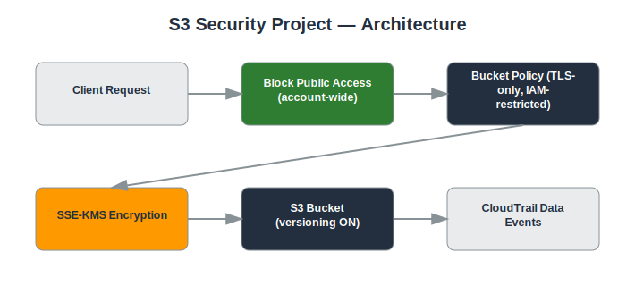

# Project: S3 Security Project

## Objective
Harden Amazon S3 buckets against accidental exposure and unauthorized access.

## Services Used
- Amazon S3
- S3 Block Public Access
- KMS
- IAM
- CloudTrail Data Events

## Architecture
- S3 Block Public Access enabled at the account and bucket level
- Bucket policies enforcing least-privilege and TLS-only access
- Default encryption (SSE-KMS) enabled on all buckets
- Versioning enabled for data recovery and ransomware protection
- CloudTrail S3 data events enabled for object-level auditing



## Implementation Steps

**1. Enable account-wide Block Public Access**

*Console:*
  - S3 console → **Block Public Access settings for this account** → **Edit** → check all four boxes → Save

*CLI:*
```bash
aws s3control put-public-access-block --account-id <ACCOUNT_ID> --public-access-block-configuration BlockPublicAcls=true,IgnorePublicAcls=true,BlockPublicPolicy=true,RestrictPublicBuckets=true
```

**2. Create the bucket with default KMS encryption**

*Console:*
  - S3 console → **Create bucket** → name it → under **Default encryption** choose **SSE-KMS** and select your CMK → Create

*CLI:*
```bash
aws s3api create-bucket --bucket my-secure-bucket-<ACCOUNT_ID>
aws s3api put-bucket-encryption --bucket my-secure-bucket-<ACCOUNT_ID> --server-side-encryption-configuration '{"Rules":[{"ApplyServerSideEncryptionByDefault":{"SSEAlgorithm":"aws:kms","KMSMasterKeyID":"<KMS_KEY_ID>"}}]}'
```

**3. Enable versioning**

*Console:*
  - S3 console → bucket → **Properties** tab → **Bucket Versioning** → **Edit** → Enable → Save

*CLI:*
```bash
aws s3api put-bucket-versioning --bucket my-secure-bucket-<ACCOUNT_ID> --versioning-configuration Status=Enabled
```

**4. Add a deny-non-TLS bucket policy**

*Console:*
  - S3 console → bucket → **Permissions** tab → **Bucket policy** → **Edit** → paste the deny-non-TLS JSON → Save

*CLI:*
```bash
aws s3api put-bucket-policy --bucket my-secure-bucket-<ACCOUNT_ID> --policy file://deny-non-tls.json
```

**5. Restrict access to a specific role**

*Console:*
  - Same **Bucket policy** editor → add a second statement scoping `Principal` to your app role ARN with `Allow` on needed actions

*CLI:*
```bash
# Edit deny-non-tls.json to add the additional Allow statement, then re-run put-bucket-policy
```

**6. Enable object-level logging**

*Console:*
  - CloudTrail console → your trail → **Edit** → **Data events** → **Add data event type** → S3 → select this bucket → Save

*CLI:*
```bash
# Configure via console; CLI equivalent uses put-event-selectors on the trail
```

**7. Test**

*Console:*
  - Try to make the bucket public via console → confirm Block Public Access refuses the change
  - Run a plain HTTP request against an object and confirm it's denied

*CLI:*
```bash
curl -I http://my-secure-bucket-<ACCOUNT_ID>.s3.amazonaws.com/testfile
```

## Security Considerations
- No S3 bucket in the account can be made public, even by mistake.
- All data encrypted at rest using customer-managed KMS keys.
- All traffic to S3 required to use TLS.
- Versioning protects against accidental deletion or overwrite.

## What I Learned
How S3 Block Public Access overrides bucket ACLs/policies, how to write policy conditions (aws:SecureTransport), and the value of object-level logging for forensics.

## Result
Hardened S3 configuration that prevents public exposure by design and provides full audit trails for object access.

## Repository Contents
- `README.md` — this file
- `templates/` — Terraform / CloudFormation / IAM policy JSON (if applicable)
- `screenshots/` — AWS Console screenshots (optional)
- `architecture.svg` — architecture diagram (included)

---
*Part of my [AWS Cloud Security Portfolio](../README.md).*
