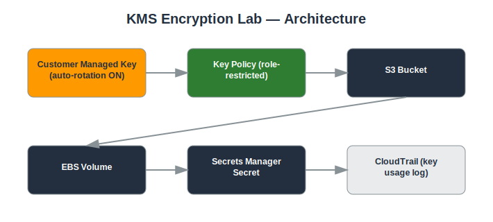

# Project: KMS Encryption Lab

## Objective
Use AWS Key Management Service to create and manage encryption keys, and apply them to protect data across multiple AWS services.

## Services Used
- AWS KMS
- S3
- EBS
- Secrets Manager
- IAM

## Architecture
- Customer-managed KMS key (CMK) with a defined key policy
- Key policy restricting key usage to specific IAM roles
- CMK used to encrypt an S3 bucket, an EBS volume, and a Secrets Manager secret
- Automatic annual key rotation enabled



## Implementation Steps

**1. Create a customer-managed key**

*Console:*
  - KMS console → **Customer managed keys** → **Create key** → Symmetric → name `portfolio-cmk` → set key administrators/users → Finish

*CLI:*
```bash
aws kms create-key --description "Portfolio CMK" --tags TagKey=Project,TagValue=KMS-Lab
```

**2. Enable automatic rotation**

*Console:*
  - KMS console → select the key → **Key rotation** tab → check **Automatically rotate this KMS key every year**

*CLI:*
```bash
aws kms enable-key-rotation --key-id <KEY_ID>
```

**3. Restrict key usage via key policy**

*Console:*
  - KMS console → key → **Key policy** tab → **Edit** → scope `kms:Decrypt` to your app role's ARN only → Save

*CLI:*
```bash
aws kms put-key-policy --key-id <KEY_ID> --policy-name default --policy file://key-policy.json
```

**4. Encrypt an S3 bucket with this key**

*Console:*
  - S3 console → bucket → **Properties** → **Default encryption** → **Edit** → SSE-KMS → choose this key → Save

*CLI:*
```bash
aws s3api put-bucket-encryption --bucket my-bucket --server-side-encryption-configuration '{"Rules":[{"ApplyServerSideEncryptionByDefault":{"SSEAlgorithm":"aws:kms","KMSMasterKeyID":"<KEY_ID>"}}]}'
```

**5. Encrypt an EBS volume**

*Console:*
  - EC2 console → **Volumes** → **Create volume** → check **Encrypt this volume** → select this key → Create

*CLI:*
```bash
aws ec2 create-volume --availability-zone us-east-1a --size 20 --encrypted --kms-key-id <KEY_ID>
```

**6. Encrypt a Secrets Manager secret**

*Console:*
  - Secrets Manager console → **Store a new secret** → enter key/value → under **Encryption key**, select this CMK → Next → Store

*CLI:*
```bash
aws secretsmanager create-secret --name app/db-password --secret-string '{"password":"REDACTED"}' --kms-key-id <KEY_ID>
```

**7. Confirm restriction and review usage**

*Console:*
  - Try decrypting/accessing as a role NOT in the key policy → confirm Access Denied
  - CloudTrail console → **Event history** → filter by resource name = key ID → review Decrypt/Encrypt events

*CLI:*
```bash
aws cloudtrail lookup-events --lookup-attributes AttributeKey=ResourceName,AttributeValue=<KEY_ID>
```

## Security Considerations
- Encryption keys are customer-managed rather than relying solely on AWS-managed keys.
- Key usage is restricted by IAM and key policy, enforcing separation of duties.
- All key usage is logged for audit purposes.

## What I Learned
The relationship between key policies and IAM policies, the difference between AWS-managed and customer-managed keys, and how encryption context adds an extra layer of control.

## Result
Implemented centralized, auditable encryption for data at rest across multiple AWS services using a single customer-managed key.

## Repository Contents
- `README.md` — this file
- `templates/` — Terraform / CloudFormation / IAM policy JSON (if applicable)
- `screenshots/` — AWS Console screenshots (optional)
- `architecture.svg` — architecture diagram (included)

---
*Part of my [AWS Cloud Security Portfolio](../README.md).*
