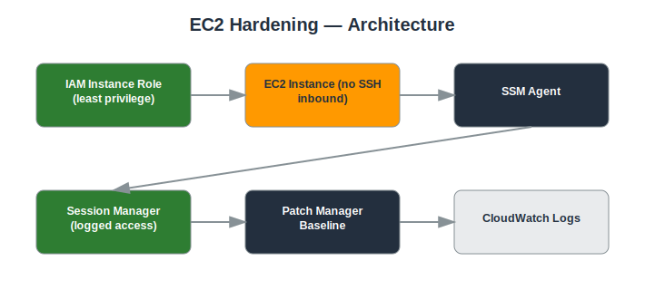

# Project: EC2 Hardening

## Objective
Secure EC2 instances by removing direct SSH exposure, enforcing least-privilege IAM roles, and keeping instances patched.

## Services Used
- EC2
- IAM Roles
- Systems Manager (Session Manager, Patch Manager)
- Security Groups

## Architecture
- EC2 instances with no inbound SSH/RDP rules (Session Manager used instead)
- IAM instance role scoped to only the permissions the application needs
- SSM Patch Manager baseline for automated patching
- Security Groups limited to required application ports only



## Implementation Steps

**1. Attach an SSM-enabled IAM role at launch**

*Console:*
  - IAM console → attach `AmazonSSMManagedInstanceCore` to `ec2-app-role`
  - EC2 console → **Launch instance** → under **IAM instance profile**, select `ec2-app-profile`

*CLI:*
```bash
aws iam attach-role-policy --role-name ec2-app-role --policy-arn arn:aws:iam::aws:policy/AmazonSSMManagedInstanceCore
aws ec2 run-instances --image-id <AMI_ID> --instance-type t3.micro --iam-instance-profile Name=ec2-app-profile --security-group-ids <SG_ID> --subnet-id <SUBNET_ID>
```

**2. Confirm no inbound SSH/RDP rule**

*Console:*
  - EC2 console → **Security Groups** → select the instance's SG → **Inbound rules** tab → confirm no rule for port 22/3389 from `0.0.0.0/0`

*CLI:*
```bash
aws ec2 describe-security-groups --group-ids <SG_ID> --query 'SecurityGroups[0].IpPermissions'
```

**3. Connect via Session Manager**

*Console:*
  - EC2 console → select the instance → **Connect** → **Session Manager** tab → **Connect**

*CLI:*
```bash
aws ssm start-session --target <INSTANCE_ID>
```

**4. Create a Patch Manager baseline**

*Console:*
  - Systems Manager console → **Patch Manager** → **Configure patching** → create a patch baseline for Amazon Linux 2 and a patch group

*CLI:*
```bash
aws ssm create-patch-baseline --name prod-baseline --operating-system AMAZON_LINUX_2
aws ssm create-resource-data-sync --sync-name patch-sync --s3-destination BucketName=<PATCH_BUCKET>,Region=us-east-1
```

**5. Run a patch scan and install**

*Console:*
  - Systems Manager console → **Patch Manager** → **Patch now** → select target instance → Operation: Scan, then rerun with Operation: Install

*CLI:*
```bash
aws ssm send-command --document-name "AWS-RunPatchBaseline" --targets "Key=instanceids,Values=<INSTANCE_ID>" --parameters "Operation=Scan"
aws ssm send-command --document-name "AWS-RunPatchBaseline" --targets "Key=instanceids,Values=<INSTANCE_ID>" --parameters "Operation=Install"
```

**6. Verify patch compliance**

*Console:*
  - Systems Manager console → **Compliance** → filter by resource ID → review Patch compliance status

*CLI:*
```bash
aws ssm list-compliance-items --resource-ids <INSTANCE_ID> --resource-types ManagedInstance
```

**7. Confirm hardening from outside**

*Console:*
  - From your laptop terminal, attempt `ssh ec2-user@<PUBLIC_IP>` and confirm it times out / connection refused

*CLI:*
```bash
ssh -o ConnectTimeout=5 ec2-user@<PUBLIC_IP>
```

## Security Considerations
- No open SSH/RDP ports reduces the attack surface significantly.
- Session Manager access is logged and does not require key pair management.
- Automated patching reduces exposure to known vulnerabilities.

## What I Learned
How Session Manager eliminates the need for bastion hosts and open SSH ports, and how to build a repeatable patching workflow with SSM.

## Result
Hardened EC2 fleet with zero open management ports, centrally logged access, and automated patch compliance.

## Repository Contents
- `README.md` — this file
- `templates/` — Terraform / CloudFormation / IAM policy JSON (if applicable)
- `screenshots/` — AWS Console screenshots (optional)
- `architecture.svg` — architecture diagram (included)

---
*Part of my [AWS Cloud Security Portfolio](../README.md).*
