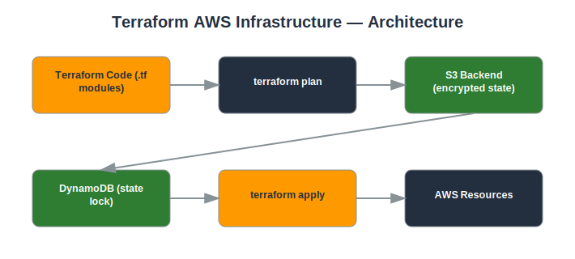

# Project: Terraform AWS Infrastructure

## Objective
Deploy secure, repeatable AWS infrastructure using Terraform (Infrastructure as Code).

## Services Used
- Terraform
- VPC
- EC2
- S3 (remote state)
- DynamoDB (state locking)
- IAM

## Architecture
- Modular Terraform structure (modules for VPC, EC2, IAM)
- Remote state stored in an encrypted S3 backend with DynamoDB state locking
- Variables and outputs used for reusability across environments
- terraform plan reviewed before every apply



## Implementation Steps

**1. Create the S3 backend + DynamoDB lock table**

*Console:*
  - S3 console → create bucket `my-tf-state-<account-id>` → enable **Versioning**
  - DynamoDB console → **Create table** → name `tf-lock`, partition key `LockID` (String)

*CLI:*
```bash
aws s3api create-bucket --bucket my-tf-state-<ACCOUNT_ID>
aws s3api put-bucket-versioning --bucket my-tf-state-<ACCOUNT_ID> --versioning-configuration Status=Enabled
aws dynamodb create-table --table-name tf-lock --attribute-definitions AttributeName=LockID,AttributeType=S --key-schema AttributeName=LockID,KeyType=HASH --billing-mode PAY_PER_REQUEST
```

**2. Define the backend and modules**

*Console:*
  - No console step — this is code-only. Open the `templates/` folder in this project and review `backend.tf`, `main.tf`, `variables.tf`, `outputs.tf`.

*CLI:*
```bash
# See templates/ folder in this project for the actual Terraform code
```

**3. Initialize**

*Console:*
  - N/A — CLI only for Terraform workflow

*CLI:*
```bash
terraform init
```

**4. Plan and review**

*Console:*
  - N/A — review the plan output directly in your terminal

*CLI:*
```bash
terraform plan -out=tfplan
```

**5. Apply**

*Console:*
  - After applying, verify resources exist via the VPC/EC2 console

*CLI:*
```bash
terraform apply tfplan
```

**6. Destroy (cleanup)**

*Console:*
  - Confirm resources are gone via the console after destroying

*CLI:*
```bash
terraform destroy
```

## Security Considerations
- State file encrypted at rest and access-controlled via IAM.
- State locking prevents concurrent modification conflicts.
- Infrastructure changes are reviewed (plan) before being applied, creating an audit trail.

## What I Learned
How to structure reusable Terraform modules, manage remote state safely, and treat infrastructure changes like code (with review before apply).

## Result
Deployed secure AWS infrastructure entirely through version-controlled, repeatable Terraform code.

## Repository Contents
- `README.md` — this file
- `templates/` — Terraform / CloudFormation / IAM policy JSON (if applicable)
- `screenshots/` — AWS Console screenshots (optional)
- `architecture.svg` — architecture diagram (included)

---
*Part of my [AWS Cloud Security Portfolio](../README.md).*
