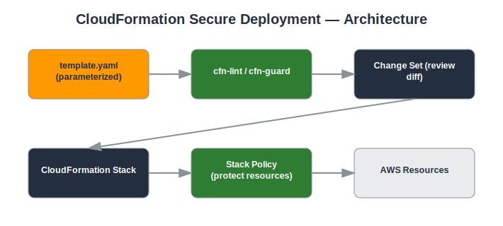

# Project: CloudFormation Secure Deployment

## Objective
Build and deploy secure AWS infrastructure as code using AWS CloudFormation.

## Services Used
- AWS CloudFormation
- VPC
- EC2
- IAM
- CloudFormation Guard / cfn-lint

## Architecture
- CloudFormation template defining VPC, subnets, Security Groups, and EC2 instances
- Parameters used to make the template reusable across environments
- Stack policies to protect critical resources from accidental updates
- Template linted with cfn-lint / validated with cfn-guard before deployment



## Implementation Steps

**1. Write and validate the template**

*Console:*
  - No console step for authoring — write `templates/template.yaml` locally

*CLI:*
```bash
pip install cfn-lint --break-system-packages
cfn-lint templates/template.yaml
aws cloudformation validate-template --template-body file://templates/template.yaml
```

**2. Create the stack**

*Console:*
  - CloudFormation console → **Create stack** → **With new resources** → **Upload a template file** → select `template.yaml` → fill in parameters → Create stack

*CLI:*
```bash
aws cloudformation create-stack --stack-name secure-infra --template-body file://templates/template.yaml --parameters ParameterKey=EnvName,ParameterValue=prod
```

**3. Watch stack events**

*Console:*
  - CloudFormation console → select the stack → **Events** tab → watch resources being created in order

*CLI:*
```bash
aws cloudformation describe-stack-events --stack-name secure-infra
```

**4. Apply a stack policy**

*Console:*
  - CloudFormation console → stack → **Stack actions** → **Edit stack policy** → paste JSON protecting the VPC resource → Save

*CLI:*
```bash
aws cloudformation set-stack-policy --stack-name secure-infra --stack-policy-body file://templates/stack-policy.json
```

**5. Update via Change Set**

*Console:*
  - CloudFormation console → stack → **Stack actions** → **Create change set for current stack** → upload the updated template → review the diff → **Execute**

*CLI:*
```bash
aws cloudformation create-change-set --stack-name secure-infra --template-body file://templates/template-v2.yaml --change-set-name update-1
aws cloudformation describe-change-set --change-set-name update-1 --stack-name secure-infra
aws cloudformation execute-change-set --change-set-name update-1 --stack-name secure-infra
```

**6. Delete the stack**

*Console:*
  - CloudFormation console → select the stack → **Delete** → confirm

*CLI:*
```bash
aws cloudformation delete-stack --stack-name secure-infra
```

## Security Considerations
- Change sets allow review of exactly what will change before deployment.
- Stack policies prevent accidental deletion/replacement of critical resources.
- Template validation catches misconfigurations before deployment.

## What I Learned
How CloudFormation manages resource dependencies and rollbacks, and how change sets support safer, auditable deployments.

## Result
Deployed a secure, parameterized infrastructure stack with a repeatable, auditable deployment process.

## Repository Contents
- `README.md` — this file
- `templates/` — Terraform / CloudFormation / IAM policy JSON (if applicable)
- `screenshots/` — AWS Console screenshots (optional)
- `architecture.svg` — architecture diagram (included)

---
*Part of my [AWS Cloud Security Portfolio](../README.md).*
