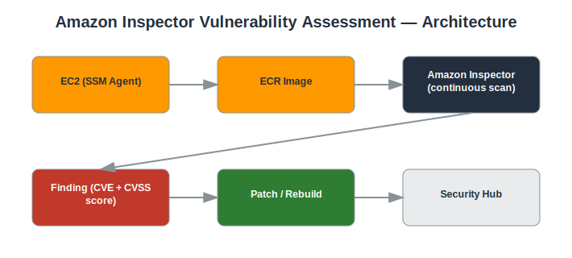

# Project: Amazon Inspector Vulnerability Assessment

## Objective
Use Amazon Inspector to continuously scan EC2 instances and container images for software vulnerabilities.

## Services Used
- Amazon Inspector
- EC2
- ECR
- Systems Manager Agent
- Security Hub

## Architecture
- Inspector enabled account-wide for EC2 and ECR scanning
- SSM Agent running on EC2 instances (required for Inspector EC2 scanning)
- Findings prioritized by CVSS score and exploitability
- Findings forwarded to Security Hub for centralized visibility



## Implementation Steps

**1. Enable Inspector**

*Console:*
  - Inspector console → **Get started** → **Enable Inspector** for EC2 and ECR

*CLI:*
```bash
aws inspector2 enable --resource-types EC2 ECR
```

**2. Confirm SSM Agent is active on targets**

*Console:*
  - Systems Manager console → **Fleet Manager** → confirm target instances show as 'Managed'

*CLI:*
```bash
aws ssm describe-instance-information
```

**3. Review findings by severity**

*Console:*
  - Inspector console → **Findings** → filter by Severity = Critical

*CLI:*
```bash
aws inspector2 list-findings --filter-criteria '{"severity":[{"comparison":"EQUALS","value":"CRITICAL"}]}'
```

**4. Investigate a finding**

*Console:*
  - Inspector console → click the finding → review the CVE ID, affected package, and fix recommendation

*CLI:*
```bash
aws inspector2 batch-get-finding-details --finding-arns <FINDING_ARN>
```

**5. Remediate**

*Console:*
  - Connect via Session Manager and update the affected package, or rebuild/redeploy the container image with the patched base layer

*CLI:*
```bash
sudo yum update <package> -y   # example for a yum-based AMI
```

**6. Re-scan and confirm**

*Console:*
  - Inspector console → refresh **Findings**, confirm the CVE no longer appears for that resource

*CLI:*
```bash
aws inspector2 list-findings --filter-criteria '{"resourceId":[{"comparison":"EQUALS","value":"<INSTANCE_ID>"}]}'
```

## Security Considerations
- Continuous, automated vulnerability scanning replaces manual point-in-time scans.
- Findings mapped to CVEs give clear, actionable remediation guidance.
- Integration with Security Hub centralizes vulnerability data with other security findings.

## What I Learned
How Inspector uses SSM and network reachability analysis to find vulnerabilities, and how to prioritize remediation using CVSS scoring.

## Result
Established continuous vulnerability scanning with a documented remediation cycle for identified CVEs.

## Repository Contents
- `README.md` — this file
- `templates/` — Terraform / CloudFormation / IAM policy JSON (if applicable)
- `screenshots/` — AWS Console screenshots (optional)
- `architecture.svg` — architecture diagram (included)

---
*Part of my [AWS Cloud Security Portfolio](../README.md).*
