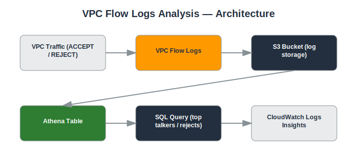

# Project: VPC Flow Logs Analysis

## Objective
Capture and analyze network traffic metadata for troubleshooting connectivity issues and detecting suspicious traffic patterns.

## Services Used
- VPC Flow Logs
- CloudWatch Logs
- Amazon Athena
- S3

## Architecture
- VPC Flow Logs enabled at the VPC level, delivered to S3
- Athena table defined over the Flow Logs S3 data for SQL querying
- CloudWatch Logs Insights used for near-real-time queries
- Sample queries built to detect rejected traffic and unusual port activity



## Implementation Steps

**1. Enable Flow Logs on the VPC**

*Console:*
  - VPC console → select the VPC → **Flow logs** tab → **Create flow log** → Destination: S3 → select bucket → Create

*CLI:*
```bash
aws ec2 create-flow-logs --resource-type VPC --resource-ids <VPC_ID> --traffic-type ALL --log-destination-type s3 --log-destination arn:aws:s3:::my-flowlogs-bucket
```

**2. Create an Athena table**

*Console:*
  - Athena console → **Query editor** → run the `CREATE EXTERNAL TABLE` statement below

*CLI:*
```sql
-- Run in Athena Query Editor (console) --
CREATE EXTERNAL TABLE vpc_flow_logs (
  version int, account_id string, interface_id string,
  srcaddr string, dstaddr string, srcport int, dstport int,
  protocol bigint, packets bigint, bytes bigint,
  start bigint, end bigint, action string, log_status string
)
ROW FORMAT DELIMITED FIELDS TERMINATED BY ' '
LOCATION 's3://my-flowlogs-bucket/AWSLogs/<ACCOUNT_ID>/vpcflowlogs/';
```

**3. Query rejected traffic**

*Console:*
  - Athena console → Query editor → run the SELECT below and review results in the table view

*CLI:*
```sql
SELECT srcaddr, COUNT(*) AS attempts
FROM vpc_flow_logs
WHERE action = 'REJECT'
GROUP BY srcaddr
ORDER BY attempts DESC
LIMIT 10;
```

**4. Query top talkers**

*Console:*
  - Athena console → Query editor → run the SELECT below

*CLI:*
```sql
SELECT srcaddr, dstaddr, SUM(bytes) AS total_bytes
FROM vpc_flow_logs
GROUP BY srcaddr, dstaddr
ORDER BY total_bytes DESC
LIMIT 10;
```

**5. Query recent traffic in CloudWatch Logs Insights**

*Console:*
  - CloudWatch console → **Logs Insights** → select the Flow Logs log group → paste the query below → Run

*CLI:*
```bash
fields @timestamp, srcAddr, dstAddr, action
| filter action = "REJECT"
| sort @timestamp desc
| limit 20
```

**6. Document a troubleshooting scenario**

*Console:*
  - Write up a real example in your README: e.g. an app couldn't reach a database, and the Flow Log query showed REJECTs on port 5432, revealing a missing Security Group rule.

## Security Considerations
- Network-level visibility into allowed and rejected traffic without needing full packet capture.
- Enables detection of port scanning, unexpected outbound connections, and misconfigured Security Groups.
- Flow Log data supports both troubleshooting and forensic investigation.

## What I Learned
How to read and query VPC Flow Log records, and how to use Athena/CloudWatch Logs Insights to turn raw network logs into actionable insight.

## Result
Built a repeatable process for querying network flow data to troubleshoot connectivity issues and spot anomalous traffic.

## Repository Contents
- `README.md` — this file
- `templates/` — Terraform / CloudFormation / IAM policy JSON (if applicable)
- `screenshots/` — AWS Console screenshots (optional)
- `architecture.svg` — architecture diagram (included)

---
*Part of my [AWS Cloud Security Portfolio](../README.md).*
