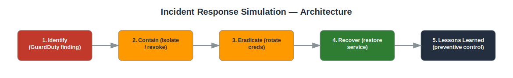

# Project: Incident Response Simulation

## Objective
Simulate investigation and remediation of a GuardDuty security finding, following a documented incident response process.

## Services Used
- GuardDuty
- CloudTrail
- IAM
- EC2
- Systems Manager
- Security Hub

## Architecture
- Simulated/sample GuardDuty finding representing compromised credentials or an anomalous EC2 instance
- CloudTrail used to trace the sequence of API calls related to the finding
- Documented IR runbook: Identify -> Contain -> Eradicate -> Recover -> Lessons Learned



## Implementation Steps

**1. Identify**

*Console:*
  - GuardDuty console → **Findings** → open the finding → note resource, principal, severity, and timestamp

*CLI:*
```bash
aws guardduty get-findings --detector-id <DETECTOR_ID> --finding-ids <FINDING_ID>
```

**2. Contain**

*Console:*
  - IAM console → select the compromised user → **Security credentials** → deactivate the access key
  - EC2 console (if instance-based) → **Change security groups** → move to `quarantine-sg`

*CLI:*
```bash
aws iam update-access-key --access-key-id <KEY_ID> --status Inactive --user-name <USER>
aws iam attach-user-policy --user-name <USER> --policy-arn arn:aws:iam::aws:policy/AWSDenyAll
```

**3. Eradicate**

*Console:*
  - CloudTrail console → **Event history** → filter by username → review and manually reverse any unauthorized changes found

*CLI:*
```bash
aws cloudtrail lookup-events --lookup-attributes AttributeKey=Username,AttributeValue=<USER> --start-time <ISO8601>
```

**4. Recover**

*Console:*
  - IAM console → re-enable the identity only after rotating credentials → IAM Access Analyzer → confirm no unexpected external access remains

*CLI:*
```bash
aws accessanalyzer list-findings --analyzer-arn <ANALYZER_ARN>
```

**5. Lessons Learned**

*Console:*
  - Document a short post-incident report: timeline, root cause, detection gap, and one concrete preventive control you're adding.

## Security Considerations
- Demonstrates a structured, repeatable incident response process rather than ad hoc reaction.
- Containment steps limit blast radius before full investigation is complete.
- Post-incident documentation drives preventive improvements.

## What I Learned
How to pivot from a single GuardDuty finding to a full investigation using CloudTrail, and how to structure an incident response runbook following industry-standard phases (NIST IR lifecycle: Preparation, Detection & Analysis, Containment/Eradication/Recovery, Post-Incident Activity).

## Result
Produced a documented, end-to-end incident response walkthrough from detection to remediation and lessons learned.

## Repository Contents
- `README.md` — this file
- `templates/` — Terraform / CloudFormation / IAM policy JSON (if applicable)
- `screenshots/` — AWS Console screenshots (optional)
- `architecture.svg` — architecture diagram (included)

---
*Part of my [AWS Cloud Security Portfolio](../README.md).*
